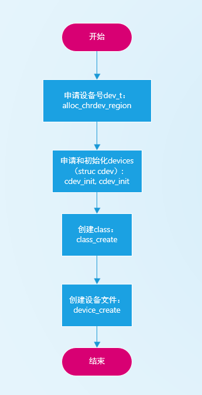
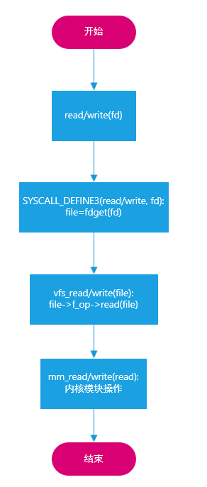
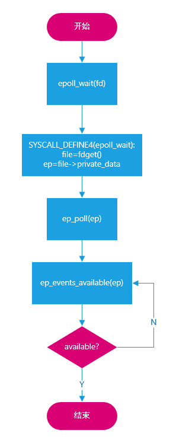
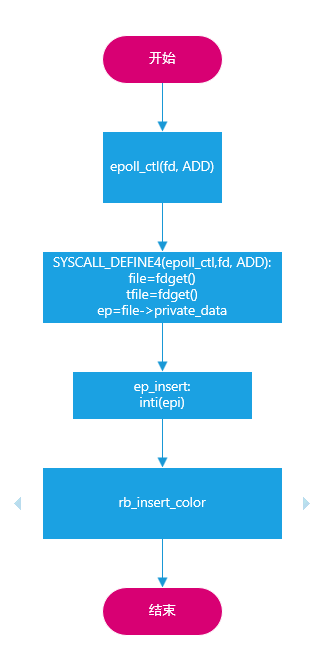
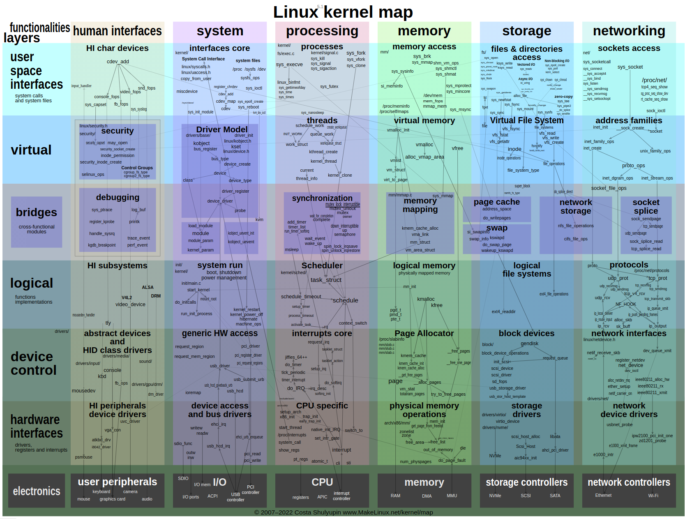

# 一、 加载模块和创建设备文件

<center>图-1.1 模块加载和设备文件创建 </center>

## 1.1 查询设备号
```shell
$ cat /proc/devices | grep 'major_minor'
241 major_minor # 可知主设备号为241

```
## 1.2 查询次设备号和和设备文件
```shell
$ ll /dev/major_minor*
crw------- 1 root root 241, 0  5月 16 23:09 /dev/major_minor0 # 主设设备号241，次设备号0
crw------- 1 root root 241, 1  5月 16 23:09 /dev/major_minor1 # 主设设备号241，次设备号1
```

# 二、read_write操作

<center>图-2.1 read_write操作 </center>

# 三、epoll_wait操作

<center>图-3.1 epoll_wait操作 </center>

# 四、epoll_ctl_ADD操作

<center>图-4.1 epoll_ctl_ADD操作 </center>

# 附录A Linux内核组成

<center>图-A.1 linux_kernel_map </center>