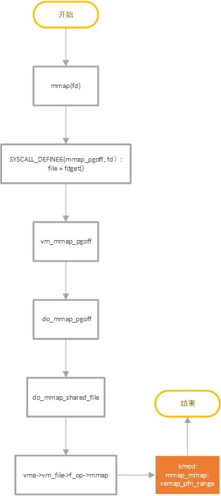

# 一、mmap 函数调用基本流程(Linux 3.10)

<center>1.1 mmap调用流程</center>

## 1. mmap_pgoff
从fd获取对应的file，随后调用vm_mmap_pgoff 
## 2. vm_mmap_pgoff持有down_write(&mm->mmap_sem)，调用 do_mmap_pgoff 
## 3. do_mmap_pgoff：
>>进行对PAGE_SIZE对齐；\
>>转换prot, flags 为vm flags；\
>>记录此次mapping；\
>>检查共享操作；\
>>申请struct vm_area_struct；\
>>调用do_mmap_shared_file
## 4.通过file->f_op->mmap调用内核模块的mmap(vma)
## 5.内核模块：mmap调用remap_pfn_range将内核模块的buff映射到用户空间
```c
static int
mmap_mmap(struct file *filep, struct vm_area_struct * vma)
{
    char *mb = filep->private_data; /*获得设备结构体指针*/

    PRINTK("mmmap_cb called\n");
#if LINUX_VERSION_CODE < KERNEL_VERSION(6, 5, 0)
    vma->vm_flags |= VM_IO;
#if LINUX_VERSION_CODE >= KERNEL_VERSION(3, 0, 0)
    vma->vm_flags |= (VM_DONTEXPAND | VM_DONTDUMP);
#else
    vma->vm_flags |= VM_RESERVED;
#endif
#endif

    if(remap_pfn_range(vma,vma->vm_start,// target user address to start at
                virt_to_phys(mb)>>PAGE_SHIFT, // physical address of kernel memory
                vma->vm_end - vma->vm_start, // size of map area
                vma->vm_page_prot)) // page protection flags for this mapping
        return  -EAGAIN;

    PRINTK("mmmap_cb exit\n");
    return 0;
}
```